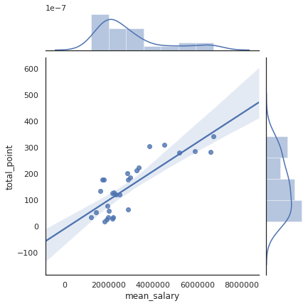

# Will Spending more money guarantees the performance in English Premier League.

*Capstone I Project for Galvanize Data Science Immersive, Week 4*

*by Jaejun Lee*

## Background and Goal
Since Machester City, a English Premier League team, had been bought by Mansour bin Zayed Al Nahyan, member of the royal family of Abu Dhabi, in 2008, the team spent over £1.4 billion in player transfer (https://www.verdict.co.uk/manchester-city-trophies-sheikh-mansour/) and achieved 7 trophies including 3 premier league title. There has been high interests and various opinions in financial spending and performance of teams in Premier League. 

> "Money makes the World go round and thus, also the Soccer?" Benedikt Droste, Toward Data Science

> "Premier League clubs ranked by highest average salaries" - NBCSports.com

> Premier League Wages Are A Disgrace -- Except When Your Team's Winning  - Bobby McMahon, Forbes

### Goal
There has been several statistical analysis between the team spending on salaries & transfers and it's performance in the league. In advance, I am more interested in the team's peformance for each match compared with the average salary of players actually involved for the game. Then, I will try to evaluate the performance of the prediction only based on the feature, Salary Delta. 

## Data and Source
Data in subject be loaed into pandas DataFrame initially with the following columns in interests.
Each row represent a game match in the premiere league fixture of each season. The data contanins 380 matchs x 4 seasons.

|Column    |Description
|---    |---
|season | Premier League Season from 2015-2016 to 2018-2019
|date   | Match Date                 
|attendance | # of attendance for the match
|squad_a    | The name of Home team
|squad_a    | The name of Away team
|goal_a     | Goal win by Home
|goal_b     | Goal win by Away
|squad_a_salary | The average salary of player in the match for Home
|squad_b_salary | The average salary of player in the match for Away
|xg_a   | The goal prediction for Home by statsbomb.com for 2018-2918 and 2017-2018 seasons
|xg_b   | The goal prediction for Home by statsbomb.com

### Data source
* https://www.spotrac.com/epl/rankings/ provides EPL Player Salary & Transfer Data for each season. Webscrapping. 
* https://fbref.com/en/comps/9/1889/schedule/2018-2019-Premier-League-Fixtures provide Premier League fixture & score data including player roll for each match. Webscrapping. 

## Exploratory Data Analysis
### First, the team's performance for the overall season based on the salary.

There is strong correlation between the average team salary and the performance of team represented in the total acquired points, For each game, the team acquire 3 points for winning, 1 point for drawing, and 0 point for loss. There is 38 matches for each team in the season. 
#### The correlation of the average team salary and the total point per each season.
|Season    |Correlation Value
|---    |---
|All    |0.83
|2018_2019  |0.84
|2017_2018  |0.83
|2016_2017  |0.77
|2015_2016  |0.57

#### The correlation of the average team salary and the average goal advantages for each game per season.
|Season    |Correlation Value
|---    |---
|All    |0.85
|2018_2019  |0.82
|2017_2018  |0.83
|2016_2017  |0.76
|2015_2016  |0.66

The following scatter and regression plots also show the strong trends. 
#### Pair Plot between the team average salary and the total point for all 4 seasons. 

  

However, the correlation value from the season 2015-2016 is a outlier from other seasons. The reason could be a distrupted winning result of an underdog, Leister City. Liester City finished top of season 2015-2106 with finance in budget. 
The average salary deployed in each game is 3.37 million pounds(7th), but acquired 81 points in total for the season. There are also noticeable misalignement from Tottenham and Chealsea in the season.

#### The top five team in the average salary in the season 2015-2016

  

#### The top five team in the total point in the season 2015-2016

  

#### The table show the top 7 teams in the average salary in the season 2015-2016

|Squad  |average salary(in millions pounds)    |total point    |Rank
|---    |---    |---    |---
|Manchester City  |7.02      |66    |5
|Manchester Utd   |6.05      |66    |4
|Chelsea          |5.22      |50    |10
|Arsenal          |4.43      |71    |2
|Liverpool        |3.80      |60    |8
|Tottenham        |3.43      |70    |3
|Leicester City   |3.37      |81    |1

### Second, how the team salary affect the peformance in each match.

For each match, I added two more columns to compare the salary and Goal. Salary Delta is the salary difference between Home team and Away team. Goal Delta is the goal difference. 

The correlation between Salary Delta and Goal Delta is 0.42. It is not strong value, but we can still observe decent relation from the box plot.

  

Since we have the goal prediction for each match in the season 2018-2019 from statsbomb.com, I tried to compare it with the prediction performance of linear regression based on only one feature, the salary delta.

Train Data is the match data from the combined season from 2015-2016, 2016-2017, and 2017-2018.
Test Data is the match data from the seaon 2018-2019.

I applied the training of data separately for Home team and Away team to predict the goal, because there is home advantage in the match.

#### Root Mean Square Error for goal predition
|Side |Salary Delta | Statsbomb
|---    |---    |---
|Home   |1.48   |1.14
|Away   |1.20   |0.96

#### The following plot shows the distribution of the squared error for the goal delta prediction.

  

#### Both prediction yield similiar squared error distribution. RMSE are also close. RMSE for goal delta prediction
|Salary Delta | Statsbomb
|---    |---
|1.68   |1.46

## Conclusion
Even though the correlation between the team salary and the performance in each match is not strong enough to assert, the salary may be the most significant feature to predict the outcome of the game. We could produce a decent prediction model only depends on the salary after all. And, we also could see that it is strongly correlated with overall teams performance in the season also.  
